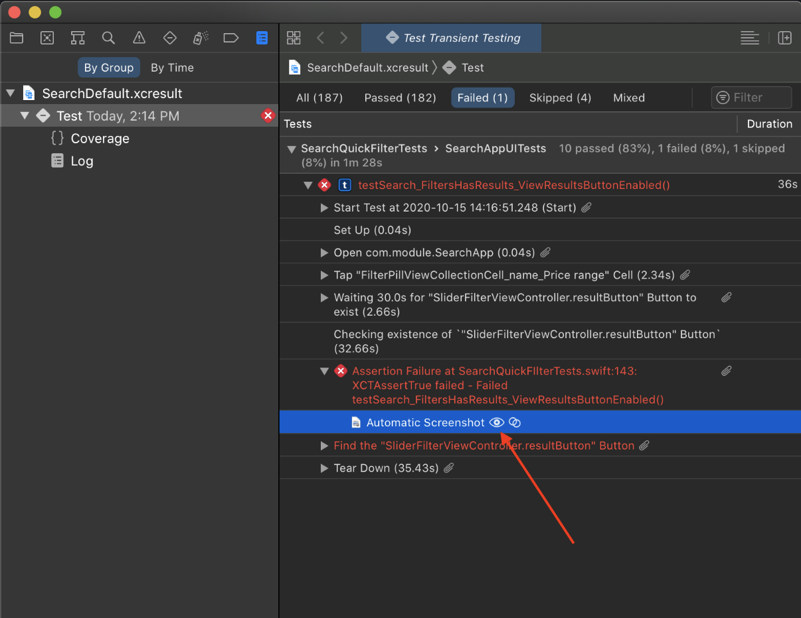
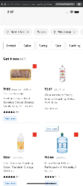
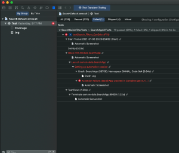
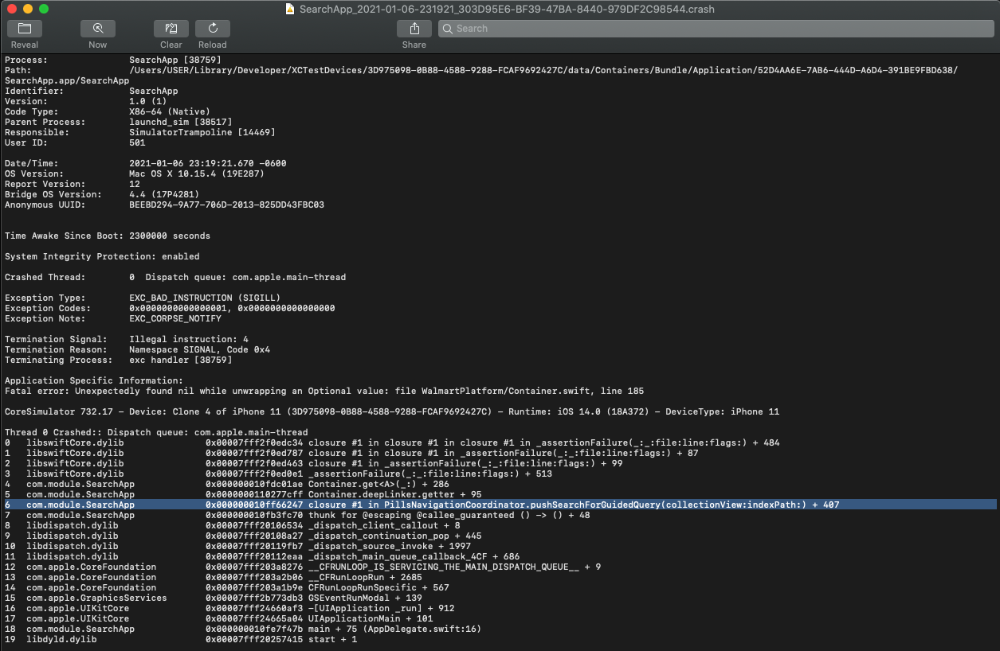
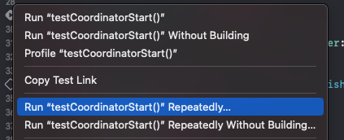
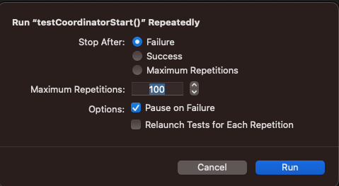

# Troubleshooting Test Failures

# First Steps

## 1. Run Locally

- If a test is failing on CI, run it locally to reproduce the failure.
- If the test passes locally but fails on CI, it may be failing due to [differences in the CI environment](#passing-locally-but-failing-on-ci) compared to your local machine or a [flaky test](#flaky-tests).
    - Does your team own the test?
        - Yes: See [troubleshooting tips](#troubleshooting-tips) for information on how to troubleshoot the failure.
        - No: [Search for known issues](#3-search-for-known-issues) in slack.
- If the test fails locally, attempt to [reproduce the failure on development](#2-run-on-development).

## 2. Run on development

- Make sure your branch is rebased with the latest development.
- Run the test on the development branch to determine if your changes are causing the test to fail.
- If the test fails on development, it could be a known issue or recently introduced issue that is unrelated to your changes.
    - Does your team own the test?
        - Yes: Notify your team of the failure and see [troubleshooting tips](#troubleshooting-tips) for information on how to troubleshoot the failure.
        - No: [Search for known issues](#3-search-for-known-issues) in slack.

## 3. Search for known issues

- Search slack ([#glass-ios](https://walmart.slack.com/archives/C011N0KG7K9) and [#mobile-release-eng](https://walmart.slack.com/archives/C9F2RS6M8)) to see if the test failure has been reported and if there is already a resolution.
- If the issue has not been reported, identify the team that owns the test using the [CODEOWNERS](https://gecgithub01.walmart.com/walmart-ios/glass-app/blob/development/.github/CODEOWNERS) file and notify them about the test failure. Please avoid tagging Platform team unless the test is owned by Platform team.
- Additionally you may use [this Splunk dashboard](https://ce-anivia-az.prod.walmart.com/en-US/app/search/is_my_test_flaky) to see how often the test fails on looper. If it fails often and in _different_ branches, then there is a good chance that this is truly a [flaky test](#flaky-tests).

## 4. Continue Troubleshooting

- Read through the [troubleshooting tips](#troubleshooting-tips) for help on how to troubleshoot test failures.
- Make sure you are following the [best practices](../testing/best-practices.md) for writing tests.

# Troubleshooting Tips

## Local failures

- Use breakpoints and other common debugging tools (enable zombies, Xcode instruments, View Hierarchy Debugger, Threads/Queues Debugger, Accessibility Inspector) - [Debugging with Xcode](https://developer.apple.com/library/archive/documentation/DeveloperTools/Conceptual/debugging_with_xcode)

- Compare results from using proxy breakpoint functionality, instant response mapping and real server response to figure out whether the issue is a race condition that can occur in real life.

- Different simulators/iOS versions can lead to different results. Be aware of known iOS bugs especially when testing using beta OS or software. 

- Over time schema changes can cause existing tests to fail unexpectedly. 

## CI failures

To troubleshoot CI failures, download [xcresults file](#xcresult-file) from looper builds linked in slack or attached as a PR comment. 

### Passing Locally but Failing on CI

There are a number of reasons a test can pass locally but fail on CI:

- **Race conditions**: Tests run more often on CI so there is a better chance for race condition errors to show up.

- **Timezone differences**: If a test is making asssumptions about the timezone that it's running in (based on your local machine), failures can occur when running on CI due to the CI machines running in a different time zone.  Make sure you're using [`Clock`](https://gecgithub01.walmart.com/pages/walmart-ios/glass-app/walmartfoundation/documentation/walmartfoundation/clock-swift.protocol) to mock Date values and following the other best practices for [controlling your test environment](../testing/best-practices.md#control-the-environment).

- **Execution timing**: Tests may timeout waiting while waiting for a UI element to appear or a condition to be satisfied due to the difference in execution time between your local machine and CI.

- **Device differences**: For UI tests it's helpful to look into which devices the test run on, it might not be the same one developer uses locally. XCUIElements might be below the fold on scroll views or obstructed by other elements therefore not found.

- **Shared state**: State that is shared across tests can cause flakiness when running on CI. This can usually be reproduced locally by running a test plan as a whole or running a specific test multiple times.

- **Data races**: When threads access a shared resource without proper synchronization; specially, this can occur when one or more threads are writing while another thread reads the same resource.

- **Other environment differences**: You may see build failures due to the running machine not being setup in the exact way as your local machine (Xcode version, dependency version, custom validation scripts failures, permission issues).  Make sure you're following all of the best practices for [controlling your test environment](../testing/best-practices.md#control-the-environment).

### Review the Build Log

Download the build log files from the link contained in the PR's failure comment. 


#### `xcresult` File

Use the `xcresult` file to see which tests failed and why.


Open the file and Xcode will display information about where and how the test failed. From here, you can get detailed information on what exactly went wrong.



You can view a screenshot of the moment in time the problem occurred.



Assuming this was a typical bug driven crash, the rollouts here will also have the crash log file itself. You can double click on the file and it will open in the Console. This crash file will be partially symbolicated, but it will show you the stack trace at the time of the crash and the responsible line in the code.





Whether you run your test suites in random or serial fashion, all the test results are stored for you in the Build Log. If you see multiple Test Suites fail, review them all to see what the actual failure was. 

If there are legit test assertions due to bugs in the code, those are easy to track down and resolve. 

### Reproducing Failures

Reproducibility is key into identifying the cause. For the first pass, turn off the Parallel running of Simulators in your testing and run all the failed Test Suites locally. This will get you very close to the runtime conditions of when the failure was first identified.

### Timeouts and Exceptions

If you see timeouts and exceptions, the investigations become a bit more involved. The best course to take here is to start looking at the first Test suite that failed due to one of these more serious causes. By addressing issues here first, you will go a long way to automatically resolve later test failures. Once a Simulator is in a bad state, other tests may be tripped up by it and fail for non-legitimate reasons. 

### Crashed Simulators

A crashed Simulator is no fun. It breaks your tests and is all but impossible to debug in Looper as all the crash info is stored outside of the Looper build directories. In order to retrieve the info you need to look at, you'll need VNC or SSH access to the host the failed build occured on.

1. Connect to Host.
2. Navigate to **/Users/jenkinspan/Library/Logs/CoreSimulator**. You will see thousands of UUID named directories here that map to Simulator instances that were used in the past. Do not fret! We know which ones to look at. 
3. Go back into the Looper job and roll open the failed Unit Test build step. Inside it, we are looking for lines that are similar to:
  ```
  SimDevice: Clone 1 of iPhone 11 (0F67DA76-FA96-4A25-A95F-E6A3DF5DA9EB, iOS 14.0, Shutdown)
  ```
We'll see about 4 of these each with a different named Clone. What we are interested in is the UUID mentioned here **(0F67DA76-FA96-4A25-A95F-E6A3DF5DA9EB)**. In that large directory, you will find directories for each of the Clones. You can either dig into the contents here, or copy them down via SCP to someplace local. Preferably inside the big zip file you downloaded. It makes for easier referencing of crashes later.

4. Once you have these directories, there are some areas of interest that are worth looking at:<br />
  ```
  CrashReporter/* # If you are really lucky, the actual crash report for the Simulator is here. Xcode is not very good about   getting this in.
  DiagnosticMessages/YYYY.MM.DD.asl
  MobileContainerManager/containermanagerd.log.0
  asl/YYYY.MM.DD.G80.asl
  ```
 
From these logs, you may be able to ascertain the root cause of the Simulator dying (memory exhaustion, disk space,  etc...), or you may end up seeing some exotic libXPC exception. Those are really between the Darwin Kernel and the Simulator process and not under our control. However, tt is good to track when you see them so we are aware of such trends.

5. Finally, pull the system diagnostics for simctl off the host.
```
xcrun simctl diagnose
```

This will take a few moments to run and will generate its own archive. Pull that over as well. It will have more crash logs for testmanagerd and other simulator executables. These are best reviewed by Apple Engineering as some of the logging here is pretty obtuse.

### Flaky Tests

Tests that fail in intermittently are known as flaky tests and can fail for similiar [reasons](#passing-locally-but-failing-on-ci) that tests fail on CI but pass locally.

[Running a test multiple times](https://developer.apple.com/documentation/xcode/running-tests-and-interpreting-results#Run-test-methods-repeatedly-to-determine-reliability) can be helpful when trying to pinpoint why a test only fails _some_ of the time.




